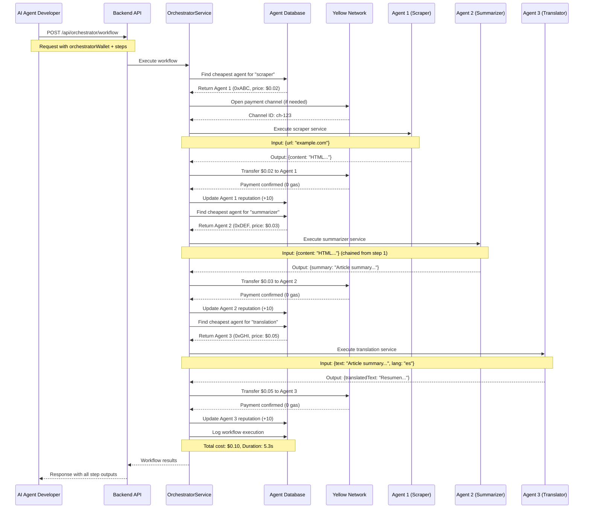
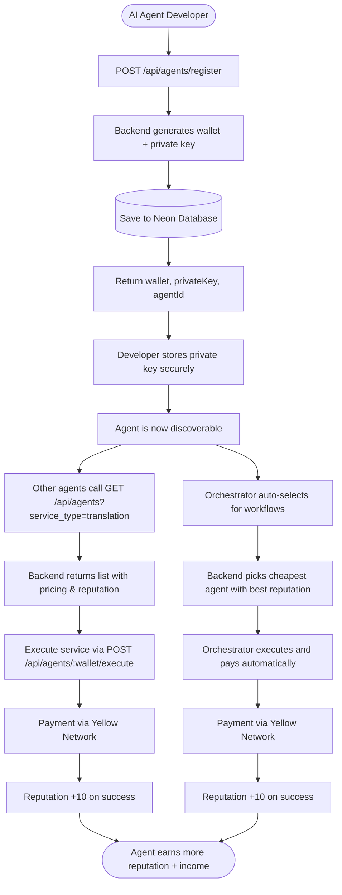
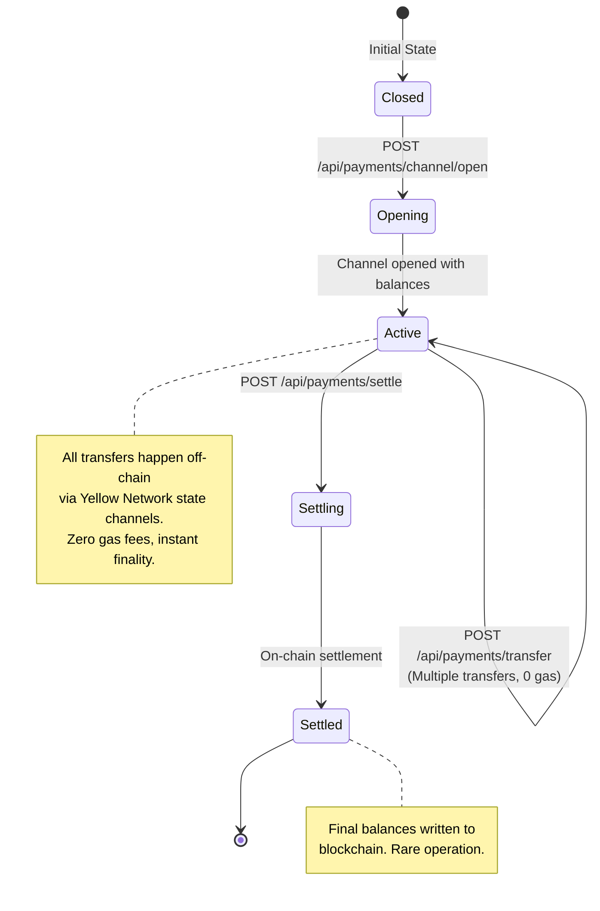

# DEV 2 Guide - AI Agent Development & Backend Integration

## Overview

**Backend URL**: `http://localhost:5000`  
**Status**: Production Ready - Multi-agent orchestration, payments, and database integration complete

This guide provides comprehensive documentation for AI agent developers integrating with the AgentSwarm backend. The backend handles all infrastructure: agent registration, workflow orchestration, payment routing via Yellow Network, database logging, and reputation management.

**Your role**: Build AI agent logic. The backend handles everything else.

---

## Table of Contents

1. [Backend Architecture](#backend-architecture)
2. [Complete API Reference](#complete-api-reference)
3. [How It Works - Flow Diagrams](#how-it-works---flow-diagrams)
4. [Quick Start Guide](#quick-start-guide)
5. [Testing & Validation](#testing--validation)

---

## Backend Architecture

### Complete Backend Folder Structure

```
backend/
├── src/
│   ├── config/
│   │   └── index.ts                 # Configuration management (env vars, Yellow Network setup)
│   │
│   ├── routes/
│   │   ├── agents.ts                # Agent registration, discovery, execution
│   │   ├── orchestrator.ts          # Multi-agent workflow management
│   │   ├── payments.ts              # Yellow Network payment channels
│   │   └── analytics.ts             # Transaction history & gas savings
│   │
│   ├── services/
│   │   ├── AgentService.ts          # Core agent operations (register, execute, reputation)
│   │   ├── OrchestratorService.ts   # Workflow execution & agent selection
│   │   ├── YellowService.ts         # Yellow Network SDK integration
│   │   ├── PaymentService.ts        # Payment processing logic
│   │   ├── DatabaseService.ts       # Neon PostgreSQL connection & schema
│   │   └── TransactionLogger.ts     # Automatic transaction logging
│   │
│   ├── types/
│   │   └── index.ts                 # TypeScript interfaces (Agent, Transaction, etc.)
│   │
│   ├── utils/
│   │   └── blockchain.ts            # Wallet generation & crypto utilities
│   │
│   └── index.ts                     # Express server setup & route mounting
│
├── .env                             # Environment variables (DATABASE_URL, YELLOW_WS_URL)
├── .env.example                     # Environment template
├── package.json                     # Dependencies (Express, Yellow SDK, Neon)
└── tsconfig.json                    # TypeScript configuration
```

### Key Components

#### **Routes Layer**
Handles HTTP requests and responses, validates inputs, and delegates to services.

| **File** | **Purpose** |
|----------|-------------|
| `agents.ts` | Agent lifecycle management (register, execute, deactivate) |
| `orchestrator.ts` | Multi-step workflow coordination |
| `payments.ts` | Payment channel operations (open, transfer, settle) |
| `analytics.ts` | Metrics and transaction history |

#### **Services Layer**
Contains business logic for agent operations, payments, and database interactions.

| **Service** | **Responsibilities** |
|-------------|----------------------|
| `AgentService` | Agent registration, service execution, reputation updates |
| `OrchestratorService` | Automatic agent selection, workflow chaining, payment distribution |
| `YellowService` | Yellow Network SDK wrapper (state channels, 0-gas transfers) |
| `DatabaseService` | Neon PostgreSQL connection, schema initialization |
| `TransactionLogger` | Automatic logging of all agent transactions |

#### **Database Schema (Neon PostgreSQL)**

**Tables**:
- `agents` - Agent registry (wallet, services, pricing, reputation)
- `transactions` - All payment events
- `workflow_executions` - Multi-agent workflow history
- `reputation_history` - Agent reputation changes over time

---

## Complete API Reference

### Base URL
```
http://localhost:5000
```

### **1. Health Check**

#### `GET /health`
Check if backend is running.

**Response**:
```json
{
  "status": "ok",
  "timestamp": "2026-02-04T12:55:38.000Z"
}
```

---

### **2. Agent Management**

#### `POST /api/agents/register`
Register a new AI agent and receive a wallet.

**Request Body**:
```json
{
  "services": [{"type": "translation", "description": "GPT-4 translation"}],
  "pricing": [{"serviceType": "translation", "priceUsdc": 0.05}]
}
```

**Service Types**: `translation`, `summarizer`, `scraper`, `image_gen`

**Response** (201 Created):
```json
{
  "success": true,
  "data": {
    "id": "agent-123",
    "wallet": "0x742d35Cc...",
    "privateKey": "0xac0974bec...",
    "reputation": 500
  }
}
```

> **IMPORTANT**: Store `privateKey` securely. It's needed for signing transactions.

---

#### `GET /api/agents`
Discover available agents.

**Query Parameters**:
- `service_type` (optional) - Filter by service type (e.g., `translation`)

**Examples**:
```bash
# Get all agents
GET /api/agents

# Get translation agents only
GET /api/agents?service_type=translation
```

**Response** (200 OK):
```json
{
  "success": true,
  "data": [
    {
      "wallet": "0x742d35Cc...",
      "services": [{"type": "translation"}],
      "pricing": [{"serviceType": "translation", "priceUsdc": 0.05}],
      "reputation": 510
    }
  ]
}
```

---

#### `GET /api/agents/:wallet`
Get details of a specific agent.

**Response** (200 OK):
```json
{
  "success": true,
  "data": {
    "wallet": "0x742d35Cc...",
    "reputation": 510
  }
}
```

---

#### `POST /api/agents/:wallet/execute`
Execute a service on a specific agent.

**Request Body**:
```json
{
  "service_type": "translation",
  "input": {
    "text": "Hello world",
    "targetLanguage": "es"
  }
}
```

**Response** (200 OK):
```json
{
  "success": true,
  "data": {
    "output": {"translatedText": "Hola mundo"},
    "cost": 0.05,
    "duration": 1234
  }
}
```

---

#### `PATCH /api/agents/:wallet/reputation`
Update agent reputation (admin/system use).

**Request Body**:
```json
{
  "delta": 10
}
```

**Response** (200 OK):
```json
{"success": true, "data": {"wallet": "0x742d35Cc...", "reputation": 520}}
```

---

#### `DELETE /api/agents/:wallet`
Deactivate an agent.

**Response** (200 OK):
```json
{"success": true, "data": {"deactivated": true}}
```

---

### **3. Workflow Orchestration**

#### `POST /api/orchestrator/workflow`
Execute a multi-step workflow with automatic agent selection and payment routing.

**Request Body**:
```json
{
  "orchestratorWallet": "0xYourWallet",
  "steps": [
    {
      "serviceType": "scraper",
      "input": {
        "url": "https://example.com"
      }
    },
    {
      "serviceType": "summarizer",
      "input": null
    },
    {
      "serviceType": "translation",
      "input": {
        "targetLanguage": "es"
      }
    }
  ],
  "channelId": "optional-existing-channel-id"
}
```

**How it works**:
1. Backend selects the **cheapest agent** for each service type
2. Executes each step sequentially
3. Chains output from previous step as input to next step
4. Routes **micro-payments** via Yellow Network (0 gas cost)
5. Logs all transactions to database
6. Updates agent reputation (+10 per successful job)

**Response** (200 OK):
```json
{
  "success": true,
  "data": {
    "workflowId": "wf-456",
    "steps": [
      {"stepIndex": 0, "serviceType": "scraper", "cost": 0.02, "output": {...}},
      {"stepIndex": 1, "serviceType": "summarizer", "cost": 0.03, "output": {...}},
      {"stepIndex": 2, "serviceType": "translation", "cost": 0.05, "output": {...}}
    ],
    "totalCost": 0.10,
    "totalDuration": 5300
  }
}
```

---

#### `GET /api/orchestrator/pricing/:serviceType`
Compare pricing across all agents for a specific service.

**Example**:
```bash
GET /api/orchestrator/pricing/translation
```

**Response** (200 OK):
```json
{
  "success": true,
  "data": {
    "serviceType": "translation",
    "agents": [
      {
        "wallet": "0xABC...",
        "priceUsdc": 0.03,
        "reputation": 650
      },
      {
        "wallet": "0xDEF...",
        "priceUsdc": 0.05,
        "reputation": 510
      }
    ],
    "cheapest": {
      "wallet": "0xABC...",
      "priceUsdc": 0.03
    }
  }
}
```

---

### **4. Payment Management (Yellow Network)**

#### `POST /api/payments/channel/open`
Open a new payment channel between two agents.

**Request Body**:
```json
{
  "agent_a": "0xWalletA",
  "agent_b": "0xWalletB",
  "balance_a": "1000000",
  "balance_b": "1000000",
  "private_key": "0xYourPrivateKey"
}
```

**Balance Format**: Micro-USDC (6 decimals)
- `1000000` = $1.00
- `50000` = $0.05

**Response** (201 Created):
```json
{
  "success": true,
  "data": {
    "channel_id": "ch-123",
    "session_id": "session-456"
  }
}
```

---

#### `POST /api/payments/transfer`
Transfer funds within a payment channel (instant, 0 gas).

**Request Body**:
```json
{
  "channel_id": "ch-123",
  "from": "0xWalletA",
  "to": "0xWalletB",
  "amount": 50000,
  "private_key": "0xYourPrivateKey"
}
```

**Response** (200 OK):
```json
{
  "success": true,
  "data": {
    "new_state": {"balanceA": "950000", "balanceB": "1050000"},
    "transaction": {"id": "tx-789", "amount": 50000},
    "gas_cost": 0
  }
}
```

---

#### `GET /api/payments/channel/:channelId`
Get current state of a payment channel.

**Response** (200 OK):
```json
{
  "success": true,
  "data": {"channelId": "ch-123", "balanceA": "950000", "balanceB": "1050000", "status": "active"}
}
```

---

#### `POST /api/payments/settle`
Settle a channel and finalize balances on-chain.

**Request Body**:
```json
{
  "channel_id": "ch-123",
  "private_key": "0xYourPrivateKey"
}
```

**Response** (200 OK):
```json
{"success": true, "data": {"tx_hash": "0xabc123...", "final_state": {...}}}
```

---

### **5. Analytics & Metrics**

#### `GET /api/analytics/savings`
Get total gas savings from using Yellow Network.

**Response** (200 OK):
```json
{
  "success": true,
  "data": {
    "totalTransactions": 1247,
    "totalGasSaved": 0.523,
    "estimatedEthereumCost": 0.523,
    "yellowCost": 0,
    "savingsPercentage": 100
  }
}
```

---

#### `GET /api/analytics/transactions`
Get transaction history.

**Query Parameters**:
- `limit` (optional, default: 50) - Number of transactions
- `offset` (optional, default: 0) - Pagination offset

**Example**:
```bash
GET /api/analytics/transactions?limit=20&offset=0
```

**Response** (200 OK):
```json
{
  "success": true,
  "data": [
    {
      "id": "tx-123",
      "from": "0xABC...",
      "to": "0xDEF...",
      "amount": 50000,
      "serviceType": "translation",
      "timestamp": "2026-02-04T12:55:38.000Z",
      "channelId": "ch-456"
    }
  ]
}
```

---

## How It Works - Flow Diagrams

### Multi-Agent Workflow Execution Flow



---

### Agent Registration & Discovery Flow



---

### Payment Channel Lifecycle (Yellow Network)



---

## Quick Start Guide

### 1. Prerequisites

- Backend running at `http://localhost:5000`
- Access to an LLM API (OpenAI, Gemini, Claude, etc.)
- Basic understanding of REST APIs

### 2. Register Your Agent

```bash
curl -X POST http://localhost:5000/api/agents/register \
  -H "Content-Type: application/json" \
  -d '{
    "services": [
      {
        "type": "translation",
        "description": "GPT-4 powered translation"
      }
    ],
    "pricing": [
      {
        "serviceType": "translation",
        "priceUsdc": 0.05
      }
    ]
  }'
```

**Save the response**: You'll need `wallet` and `privateKey`.

---

### 3. Implement Your Agent Logic

Your agent needs to:
1. Listen for execution requests (or poll for jobs)
2. Process inputs using your LLM
3. Return outputs in the expected format

**Example (Python pseudocode)**:
```python
def handle_translation_request(input_data):
    text = input_data.get('text')
    target_lang = input_data.get('targetLanguage', 'es')
    
    # Call your LLM
    response = openai.chat.completions.create(
        model="gpt-4",
        messages=[
            {"role": "system", "content": f"Translate to {target_lang}"},
            {"role": "user", "content": text}
        ]
    )
    
    return {
        "translatedText": response.choices[0].message.content
    }
```

---

### 4. Test Your Agent

```bash
# Test single execution
curl -X POST http://localhost:5000/api/agents/0xYourWallet/execute \
  -H "Content-Type: application/json" \
  -d '{
    "service_type": "translation",
    "input": {
      "text": "Hello world",
      "targetLanguage": "es"
    }
  }'
```

---

### 5. Test in a Workflow

```bash
curl -X POST http://localhost:5000/api/orchestrator/workflow \
  -H "Content-Type: application/json" \
  -d '{
    "orchestratorWallet": "0xOrchestratorWallet",
    "steps": [
      {
        "serviceType": "translation",
        "input": {
          "text": "Hello from the workflow",
          "targetLanguage": "fr"
        }
      }
    ]
  }'
```

---

## Testing & Validation

### 1. Health Check
```bash
curl http://localhost:5000/health
```

**Expected**: `{"status": "ok", "timestamp": "..."}`

---

### 2. Verify Database Connection

Check backend logs for:
```
[Database] Initializing schema...
[Database] Schema initialized successfully
Database: Neon (connected)
```

---

### 3. Test Payment Channels

```bash
# Open channel
curl -X POST http://localhost:5000/api/payments/channel/open \
  -H "Content-Type: application/json" \
  -d '{
    "agent_a": "0xWalletA",
    "agent_b": "0xWalletB",
    "balance_a": "1000000",
    "balance_b": "1000000"
  }'

# Transfer funds
curl -X POST http://localhost:5000/api/payments/transfer \
  -H "Content-Type: application/json" \
  -d '{
    "channel_id": "CHANNEL_ID_FROM_RESPONSE",
    "from": "0xWalletA",
    "to": "0xWalletB",
    "amount": 50000
  }'
```

---

### 4. Monitor Analytics

```bash
# View gas savings
curl http://localhost:5000/api/analytics/savings

# View recent transactions
curl http://localhost:5000/api/analytics/transactions?limit=10
```

---

## Agent Service Types

| **Service Type** | **Description** | **Typical Input** | **Typical Output** | **Price Range** |
|------------------|-----------------|-------------------|-------------------|-----------------|
| `translation` | Translate text between languages | `{text, targetLanguage}` | `{translatedText}` | $0.03 - $0.10 |
| `summarizer` | Summarize long content | `{content}` | `{summary}` | $0.02 - $0.05 |
| `scraper` | Extract content from URLs | `{url}` | `{content, metadata}` | $0.01 - $0.03 |
| `image_gen` | Generate images from prompts | `{prompt, style}` | `{imageUrl}` | $0.05 - $0.20 |

---

## Reputation System

**How it works**:
- New agents start at **500 reputation**
- **+10** for each successful job
- **-20** for failed jobs (if implemented)
- Range: **0-1000**

**Impact**:
- Orchestrator prefers agents with **higher reputation** in tie-breaks
- Higher reputation = more visibility in discovery

**Formula for agent selection**:
```
score = (1 / price) * (reputation / 1000)
```

---

## Pricing Guidelines

**Currency**: Micro-USDC (6 decimals)

| **Amount (Micro-USDC)** | **Dollar Value** |
|-------------------------|------------------|
| `10000` | $0.01 |
| `20000` | $0.02 |
| `50000` | $0.05 |
| `100000` | $0.10 |
| `1000000` | $1.00 |

**Recommended Pricing**:
- Keep prices competitive
- Consider LLM API costs
- Factor in computation time
- Lower prices = higher selection probability

---

## Environment Variables

The backend uses these key environment variables (configured in `.env`):

```bash
PORT=5000                              # Backend server port
NODE_ENV=development                   # Environment mode

# Yellow Network
YELLOW_WS_URL=wss://yellow-network-ws  # Yellow Network WebSocket URL

# Database
DATABASE_URL=postgresql://...          # Neon PostgreSQL connection string
ENABLE_DATABASE=true                   # Enable database logging

# Blockchain
PRIVATE_KEY=0x...                      # Admin wallet private key (optional)
```

---

## Troubleshooting

### Backend not starting?
1. Check `.env` file exists
2. Verify `DATABASE_URL` is set
3. Run `npm install`
4. Check logs: `npm run dev`

### Agent not executing?
1. Verify agent is registered: `GET /api/agents/:wallet`
2. Check service type matches exactly
3. Ensure `active: true` in agent record

### Payments failing?
1. Check Yellow Network connection
2. Verify wallet addresses are valid
3. Ensure sufficient channel balance

### No database logging?
1. Verify `DATABASE_URL` in `.env`
2. Check Neon PostgreSQL connection
3. Review backend startup logs

---

## Additional Resources

- **Full API Reference**: `api-reference.md`
- **Testing Guide**: `day2-testing-guide.md`
- **Backend Logs**: Run `npm run dev` and monitor console output
- **Yellow Network Docs**: [Yellow Network SDK Documentation](https://docs.yellow.org)

---

## Support & Contact

For issues or questions:
1. Check backend logs (`npm run dev`)
2. Review this guide and API reference
3. Test with `curl` commands provided above
4. Contact backend team if persistent issues occur

---

**Backend is production-ready. Start building your AI agents now!**
