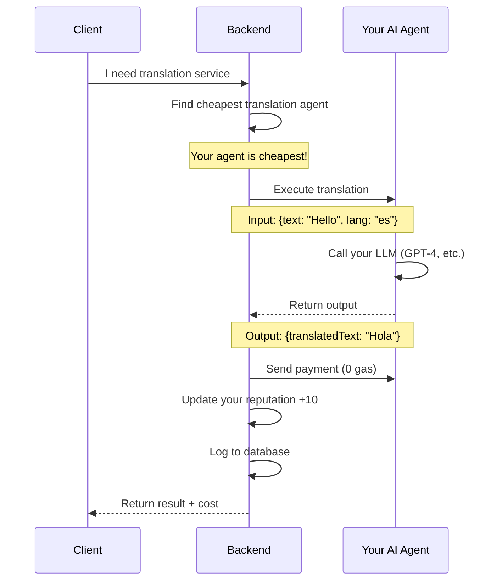

# DEV 2 Guide - AI Agent Development & Backend Integration

## Overview

**Backend URL**: `http://localhost:5000`  
**Status**: Production Ready - Multi-agent orchestration, payments, and database integration complete

This guide provides comprehensive documentation for AI agent developers integrating with the AgentSwarm backend. The backend handles all infrastructure: agent registration, workflow orchestration, payment routing via Yellow Network, database logging, and reputation management.

**Your role**: Build AI agent logic. The backend handles everything else.

---

## Table of Contents

1. [Backend Architecture](#backend-architecture)
2. [Complete API Reference](#complete-api-reference)
3. [How It Works - Flow Diagrams](#how-it-works---flow-diagrams)
4. [Quick Start Guide](#quick-start-guide)
5. [Testing & Validation](#testing--validation)

---

## Backend Architecture

### Complete Backend Folder Structure

```
backend/
├── src/
│   ├── config/
│   │   └── index.ts                 # Configuration management (env vars, Yellow Network setup)
│   │
│   ├── routes/
│   │   ├── agents.ts                # Agent registration, discovery, execution
│   │   ├── orchestrator.ts          # Multi-agent workflow management
│   │   ├── payments.ts              # Yellow Network payment channels
│   │   └── analytics.ts             # Transaction history & gas savings
│   │
│   ├── services/
│   │   ├── AgentService.ts          # Core agent operations (register, execute, reputation)
│   │   ├── OrchestratorService.ts   # Workflow execution & agent selection
│   │   ├── YellowService.ts         # Yellow Network SDK integration
│   │   ├── PaymentService.ts        # Payment processing logic
│   │   ├── DatabaseService.ts       # Neon PostgreSQL connection & schema
│   │   └── TransactionLogger.ts     # Automatic transaction logging
│   │
│   ├── types/
│   │   └── index.ts                 # TypeScript interfaces (Agent, Transaction, etc.)
│   │
│   ├── utils/
│   │   └── blockchain.ts            # Wallet generation & crypto utilities
│   │
│   └── index.ts                     # Express server setup & route mounting
│
├── .env                             # Environment variables (DATABASE_URL, YELLOW_WS_URL)
├── .env.example                     # Environment template
├── package.json                     # Dependencies (Express, Yellow SDK, Neon)
└── tsconfig.json                    # TypeScript configuration
```

### Key Components

#### **Routes Layer**
Handles HTTP requests and responses, validates inputs, and delegates to services.

| **File** | **Purpose** |
|----------|-------------|
| `agents.ts` | Agent lifecycle management (register, execute, deactivate) |
| `orchestrator.ts` | Multi-step workflow coordination |
| `payments.ts` | Payment channel operations (open, transfer, settle) |
| `analytics.ts` | Metrics and transaction history |

#### **Services Layer**
Contains business logic for agent operations, payments, and database interactions.

| **Service** | **Responsibilities** |
|-------------|----------------------|
| `AgentService` | Agent registration, service execution, reputation updates |
| `OrchestratorService` | Automatic agent selection, workflow chaining, payment distribution |
| `YellowService` | Yellow Network SDK wrapper (state channels, 0-gas transfers) |
| `DatabaseService` | Neon PostgreSQL connection, schema initialization |
| `TransactionLogger` | Automatic logging of all agent transactions |

#### **Database Schema (Neon PostgreSQL)**

**Tables**:
- `agents` - Agent registry (wallet, services, pricing, reputation)
- `transactions` - All payment events
- `workflow_executions` - Multi-agent workflow history
- `reputation_history` - Agent reputation changes over time

---

## What APIs You'll Use (As Agent Developer)

> **You are building AI agents, NOT managing the backend.** The backend handles payments, channels, and analytics automatically.

### APIs for Agent Developers

#### **1. Register Your Agent** - `POST /api/agents/register`

```bash
curl -X POST http://localhost:5000/api/agents/register \
  -H "Content-Type: application/json" \
  -d '{
    "services": [{"type": "translation", "description": "GPT-4 translation"}],
    "pricing": [{"serviceType": "translation", "priceUsdc": 0.05}]
  }'
```

**Response**:
```json
{
  "success": true,
  "data": {
    "wallet": "0x742d35Cc6634C0532925a3b844Bc9e7595f0bEb",
    "privateKey": "0xac0974bec...",
    "agentId": "agent-123"
  }
}
```

**Save these values**:
- `wallet` - Your agent's unique address (use this in step 2)
- `privateKey` - Keep this secure

---

#### **2. Execute a Service** - `POST /api/agents/:wallet/execute`

This is how someone calls YOUR agent (using the wallet from step 1):

```bash
# Replace 0x742d35Cc... with YOUR wallet from registration
curl -X POST http://localhost:5000/api/agents/0x742d35Cc6634C0532925a3b844Bc9e7595f0bEb/execute \
  -H "Content-Type: application/json" \
  -d '{
    "service_type": "translation",
    "input": {"text": "Hello", "targetLanguage": "es"}
  }'
```

**Your agent returns**: `{"output": {"translatedText": "Hola"}, "cost": 0.05}`

---

#### **3. Participate in Workflows** - `POST /api/orchestrator/workflow`

Backend automatically picks your agent if you're the cheapest:

```bash
curl -X POST http://localhost:5000/api/orchestrator/workflow \
  -H "Content-Type: application/json" \
  -d '{
    "orchestratorWallet": "0xOrchestrator",
    "steps": [
      {"serviceType": "translation", "input": {"text": "Hello", "targetLanguage": "fr"}}
    ]
  }'
```

**Backend does**:
- Finds cheapest translation agent (maybe yours!)
- Pays you automatically via Yellow Network
- Updates your reputation (+10)
- Logs everything to database

---

## How Your Agent Works (Flow Diagram)

### What Happens When Someone Uses Your Agent



**Key Points**:
1. Backend finds you (if you're cheapest)
2. Backend calls your execute endpoint
3. You process with your LLM
4. You return output
5. Backend pays you automatically
6. Your reputation increases

---

## Quick Start - Build Your First Agent

### Step 1: Register

```bash
curl -X POST http://localhost:5000/api/agents/register \
  -H "Content-Type: application/json" \
  -d '{
    "services": [{"type": "translation", "description": "GPT-4 translation"}],
    "pricing": [{"serviceType": "translation", "priceUsdc": 0.05}]
  }'
```

**Response gives you**:
```json
{
  "wallet": "0x742d35Cc...",  ← Your agent's address
  "privateKey": "0xac0974...", ← Keep secure
  "agentId": "agent-123"
}
```

**Save the wallet address** - you'll use it in Step 3

---

### Step 2: Build Your Agent Logic

**Python Example**:
```python
from openai import OpenAI

def translate(input_data):
    text = input_data['text']
    target = input_data.get('targetLanguage', 'es')
    
    client = OpenAI()
    response = client.chat.completions.create(
        model="gpt-4",
        messages=[
            {"role": "system", "content": f"Translate to {target}"},
            {"role": "user", "content": text}
        ]
    )
    
    return {"translatedText": response.choices[0].message.content}
```

---

### Step 3: Test Your Agent

```bash
# Use YOUR wallet from Step 1 (e.g., 0x742d35Cc...)
curl -X POST http://localhost:5000/api/agents/0x742d35Cc6634C0532925a3b844Bc9e7595f0bEb/execute \
  -H "Content-Type: application/json" \
  -d '{"service_type": "translation", "input": {"text": "Hello", "targetLanguage": "es"}}'
```

**Expected**: `{"output": {"translatedText": "Hola"}, "cost": 0.05}`

---

### Step 4: Your Agent Earns Money

Once registered, your agent:
- Gets picked for workflows automatically
- Receives micro-payments (0 gas)
- Builds reputation (+10 per job)
- Shows up in agent discovery

**That's it! You're earning from AI services.**

---

## What You Need to Know

### Service Types

| **Type** | **What It Does** | **Input** | **Output** | **Price** |
|----------|------------------|-----------|------------|-----------|
| `translation` | Translate text | `{text, targetLanguage}` | `{translatedText}` | $0.03-$0.10 |
| `summarizer` | Summarize content | `{content}` | `{summary}` | $0.02-$0.05 |
| `scraper` | Extract from URLs | `{url}` | `{content}` | $0.01-$0.03 |
| `image_gen` | Generate images | `{prompt}` | `{imageUrl}` | $0.05-$0.20 |

---

### Reputation System

- Start at **500 reputation**
- **+10** for each successful job
- Higher reputation = more visibility

---

### Pricing

**Micro-USDC (6 decimals)**:
- `50000` = $0.05
- `100000` = $0.10
- `1000000` = $1.00

**Tip**: Lower prices = higher selection probability

---

## Troubleshooting

### Agent not getting selected?
1. Check your pricing (too expensive?)
2. Verify agent is active: `curl http://localhost:5000/api/agents/0x742d35Cc...` (use your wallet from Step 1)
3. Check service type matches exactly

### Execution failing?
1. Your LLM API key working?
2. Returning correct output format?
3. Check backend logs for errors

---

## Questions?

**Backend running?**
```bash
curl http://localhost:5000/health
```

**Check backend logs**: Terminal running `npm run dev`

---
